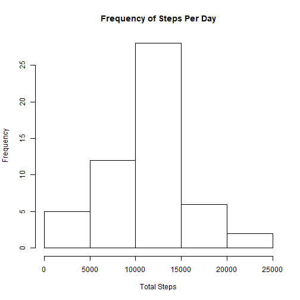
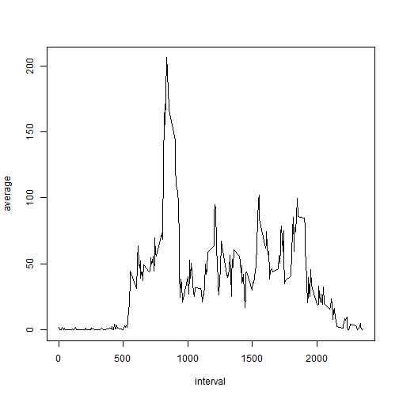
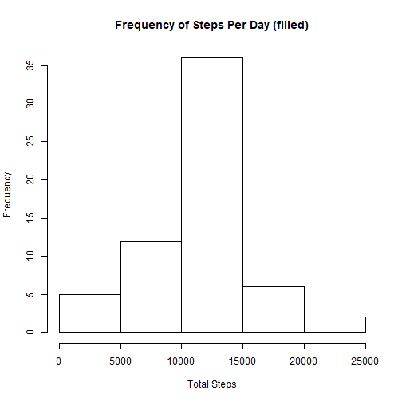
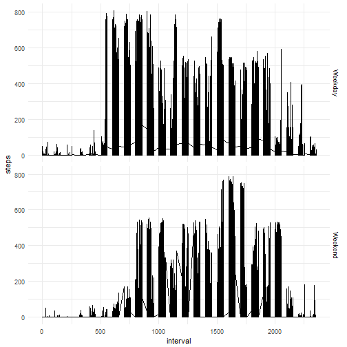

```r
knitr::opts_chunk$set(echo = TRUE)
library(tidyverse)
```

```
## Warning: package 'tidyverse' was built under R version 3.4.4
```

```
## -- Attaching packages --------------------------------------- tidyverse 1.2.1 --
```

```
## v ggplot2 2.2.1     v purrr   0.2.4
## v tibble  1.4.2     v dplyr   0.7.4
## v tidyr   0.8.0     v stringr 1.3.0
## v readr   1.1.1     v forcats 0.3.0
```

```
## Warning: package 'ggplot2' was built under R version 3.4.4
```

```
## Warning: package 'tibble' was built under R version 3.4.4
```

```
## Warning: package 'tidyr' was built under R version 3.4.4
```

```
## Warning: package 'readr' was built under R version 3.4.4
```

```
## Warning: package 'purrr' was built under R version 3.4.4
```

```
## Warning: package 'stringr' was built under R version 3.4.4
```

```
## Warning: package 'forcats' was built under R version 3.4.4
```

```
## -- Conflicts ------------------------------------------ tidyverse_conflicts() --
## x dplyr::filter() masks stats::filter()
## x dplyr::lag()    masks stats::lag()
```

```r
library(lubridate)
```

```
## Warning: package 'lubridate' was built under R version 3.4.4
```

```
## 
## Attaching package: 'lubridate'
```

```
## The following object is masked from 'package:base':
## 
##     date
```

```r
library(dplyr)
```


# Part 1 
## Loading and preprocessing the data

1. Load the data

```r
###
activityData <- read.csv("./data/activity.csv")
str(activityData)
```

```
## 'data.frame':	17568 obs. of  3 variables:
##  $ steps   : int  NA NA NA NA NA NA NA NA NA NA ...
##  $ date    : Factor w/ 61 levels "2012-10-01","2012-10-02",..: 1 1 1 1 1 1 1 1 1 1 ...
##  $ interval: int  0 5 10 15 20 25 30 35 40 45 ...
```

# Part 2
## What is mean total number of steps taken per day?

1. Calculate the total number of steps taken per day


```r
stepsPerDay <- 
      activityData %>% 
      na.omit() %>% 
      group_by(date) %>% 
      summarise(steps = (sum(steps)))
```

```
## Warning: package 'bindrcpp' was built under R version 3.4.4
```


2. Histogram of the total number of steps

```r
##histogram
hist(stepsPerDay$steps,
      main = "Frequency of Steps Per Day",
      xlab = "Total Steps")
```



3. Calculate the mean and median of the total steps taken per day


```r
##mean
mean(stepsPerDay$steps)
```

```
## [1] 10766.19
```

```r
##median
median(stepsPerDay$steps)
```

```
## [1] 10765
```

```r
##total
sum(stepsPerDay$steps)
```

```
## [1] 570608
```

# Part 3
## What is the average daily activity pattern
1. Make a time series plot of the 5-minute interval and the average number of steps taken, averaged across all days


```r
activityPattern <- activityData %>% 
  group_by(interval) %>% 
  na.omit() %>% 
  dplyr::summarize(average = mean(steps))
plot(activityPattern, type ="l")
```



2. Which 5-minute interval, on average across all the days contains the maximum number of steps?


```r
activityPattern %>% 
  arrange(desc(average)) %>% 
  top_n(1)
```

```
## Selecting by average
```

```
## # A tibble: 1 x 2
##   interval average
##      <int>   <dbl>
## 1      835    206.
```

#Part 4
## Imputing missing values

1. Calculate and report the number of missing values in the dataset

```r
##Imput missing values
sum(is.na(activityData))
```

```
## [1] 2304
```

2. Devise a strategy for filling in all the missing values in the dataset:
* Replace NA's with the average for the interval across all days

3. Create a new dataset that is equal to the original dataset but with the missing data filled in

```r
### Replace NA's with average for the interval
activityData.f <- activityData %>% 
  group_by(interval) %>% 
 mutate(steps = replace_with_mean(steps))
```

4. Make a histogram of the total number of steps taken each day and Calculate and report the mean and median total number of steps taken per day.

```r
stepsPerDay.f <- 
  activityData.f %>% 
  group_by(date) %>% 
  summarise(steps = (sum(steps)))

hist(stepsPerDay.f$steps,
     main = "Frequency of Steps Per Day (filled)",
     xlab = "Total Steps")
```



```r
##mean
mean(stepsPerDay.f$steps)
```

```
## [1] 10766.19
```

```r
##median
median(stepsPerDay.f$steps)
```

```
## [1] 10766.19
```

```r
##total
sum(stepsPerDay.f$steps)
```

```
## [1] 656737.5
```
Do these values differ from the estimates from the first part of the assignment? 
* The mean does not, the median does slightly slightly here are the differences:
***
Mean

```r
##mean
mean(stepsPerDay$steps) - mean(stepsPerDay.f$steps)
```

```
## [1] 0
```
Median

```r
##median
median(stepsPerDay$steps) -
  median(stepsPerDay.f$steps)
```

```
## [1] -1.188679
```

What is the impact of imputing missing data on the estimates of the total daily number of steps?
* It shifts the median slightly to the left

# Part 5
## Are there differences between weekends and weekdays

1. Create a new factor variable in the dataset with two levels – “weekday” and “weekend” indicating whether a given date is a weekday or weekend day.

```r
activityWeekend <- activityData.f %>% 
  mutate(weekday = weekdays(ymd(date))) %>% 
  mutate(DayType = as.factor(ifelse(weekday %in% c("Saturday", "Sunday"), "Weekend", "Weekday")))
```

2. Make a panel plot containing a time series plot of the 5-minute interval (x-axis) and the average number of steps taken, averaged across all weekday days or weekend days (y-axis).


```r
a  <- ggplot(data = activityWeekend, 
       aes(x = interval, y= steps)) +
      geom_line()


a + facet_grid(DayType ~ .) +
  theme_minimal()
```


